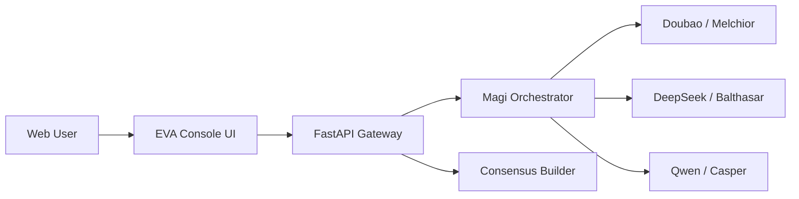

# EVA 三贤人系统设计稿

## 目标

构建一个可外部访问的 EVA 风格三贤人系统，将以下三家模型统一编排：

- MELCHIOR：Doubao
- BALTHASAR：DeepSeek
- CASPER：Qwen

系统输出应包含三位贤人的独立意见，以及面向业务使用者的综合决议。

## 架构概览



## 模块划分

### 1. 前端控制台

- EVA 风格控制台界面
- 输入会商问题、系统提示词、采样参数
- 展示三位贤人的独立响应
- 展示综合决议
- 显示各节点状态与时延

### 2. API 网关

- `GET /healthz`：健康检查
- `GET /api/providers`：查看贤人配置状态
- `POST /api/deliberate`：发起三贤人会商

### 3. Magi Orchestrator

- 统一管理三家 provider
- 并发调用各模型
- 收集响应、时延、异常状态
- 将结果交给决议构建器

### 4. Provider Adapter

统一字段：

- `api_key`
- `base_url`
- `model`
- `persona`

这使得 Doubao、DeepSeek、Qwen 都能以同一调用路径接入。

## 对外访问方案

### 开发环境

服务监听：

```text
0.0.0.0:8000
```

### 生产环境推荐

- 反向代理：Nginx 或 Caddy
- HTTPS：Let's Encrypt
- 进程托管：systemd、supervisor、Docker、PaaS
- API Key：仅保留在服务端环境变量

## 视觉设计方向

- 整体视觉参考 EVA 指挥中枢和战术面板
- 使用青绿色 HUD 线条配合橙红高亮
- 加入扫描线、网格、玻璃面板和高对比标题
- 移动端保留信息层级，不做简单堆叠式平庸布局

## 后续可扩展项

- 增加 SSE 流式输出
- 增加会商历史记录
- 增加用户登录和权限控制
- 增加数据库存储
- 增加分歧检测与投票权重
- 增加联网检索和知识库模式
